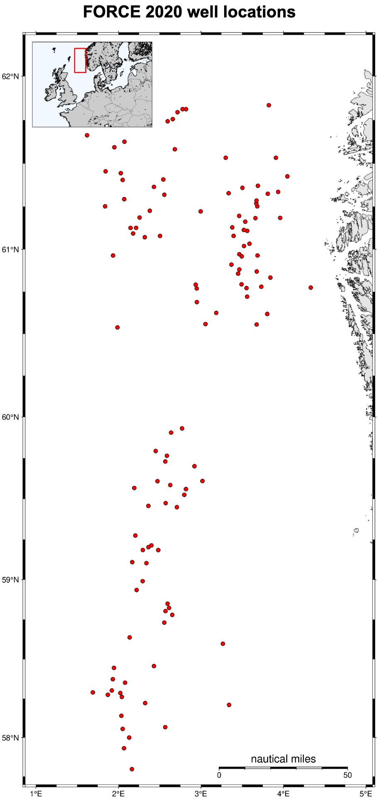
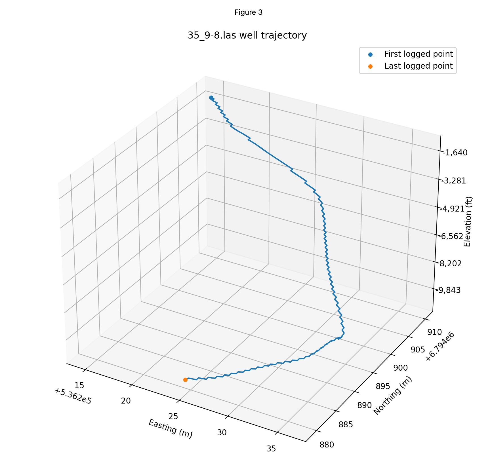
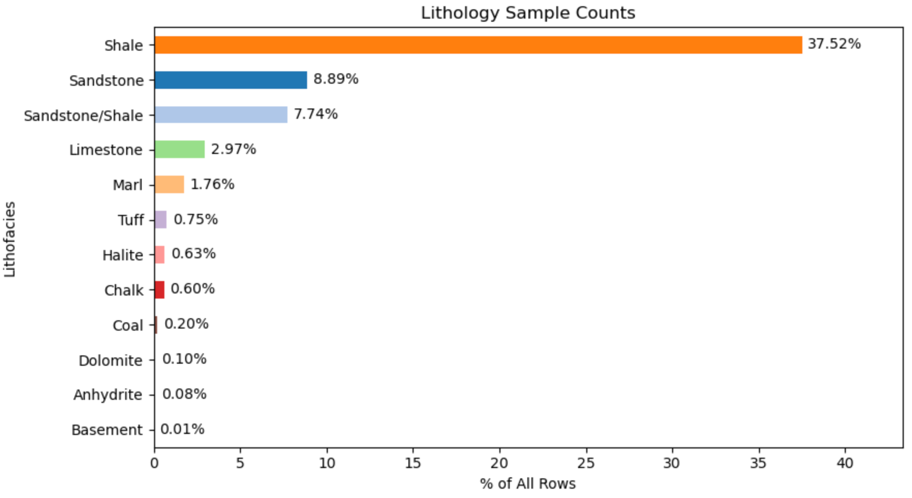
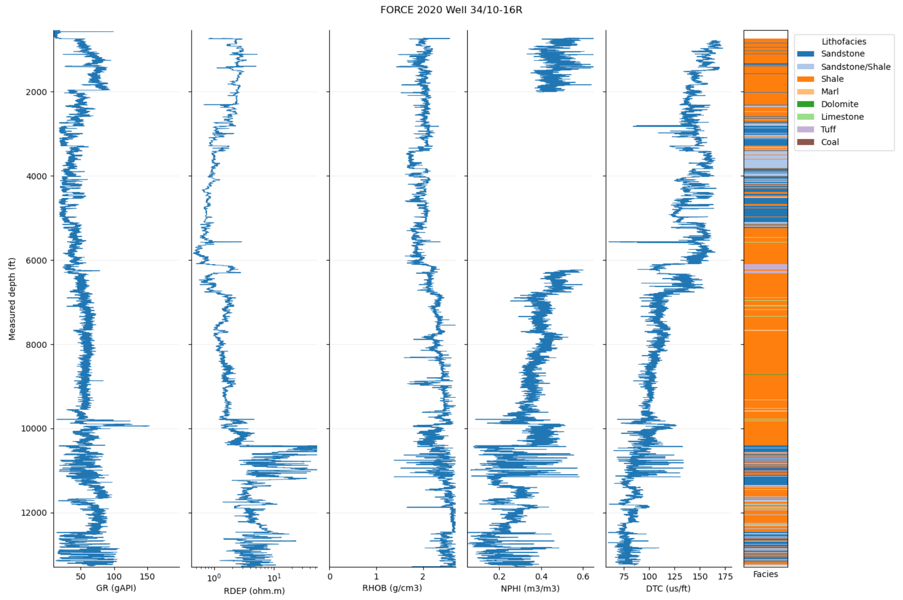
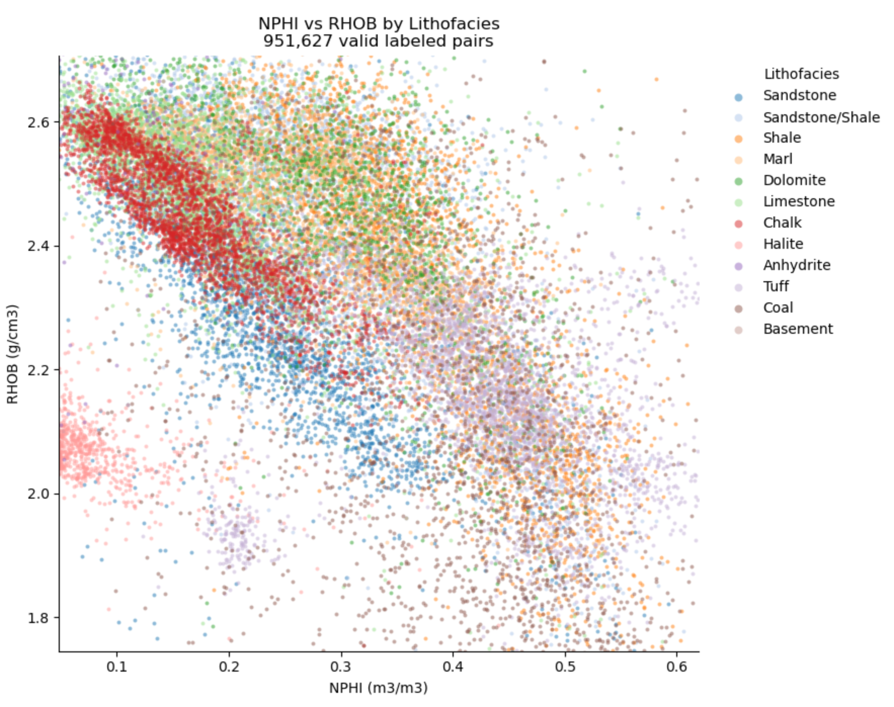
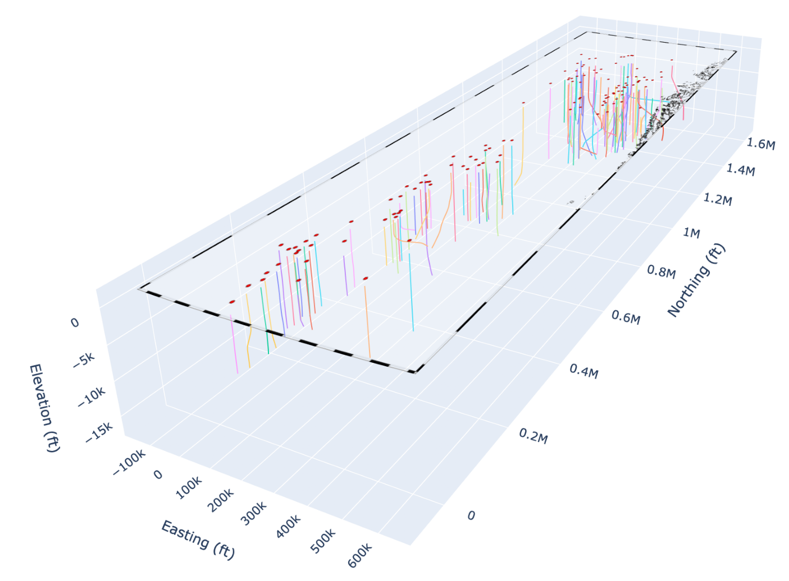

# FORCE 2020 Well-Log Analysis
     
## Purpose
This project uses the public FORCE 2020 North Sea well-log
dataset to develop reproducible workflows for subsurface data
quality assessment, exploratory analysis and SQL/Pandas data
manipulation.

<h2>Dataset geometry</h2>

<table>
<tr>
<td width="42%" align="center">
  
</td>
<td width="58%" align="center">
  
</td>
</tr>
<!-- <tr>
<td align="center">118 FORCE 2020 well locations</td>
<td align="center">Example reconstructed well trajectory</td>
</tr> -->
</table>

## Current work

- Built an inventory of all 118 LAS wells, including depth range, sampling interval, available curves and missing-data coverage.

- Mapped well locations and reconstructed available well trajectories to examine the deviation and 3d spatial structure of the dataset.

- Combined selected logs from all wells into a sample-level dataset containing about 2.34 million depth rows.

- Examined original lithofacies labels and interpretation-confidence values across wells.

- Analysed GR, RHOB, NPHI, DTC, RDEP and PEF distributions and data completeness.

- Compared log responses between lithofacies using representative well panels and petrophysical crossplots.

- SQL analysis using DuckDB

## Exploratory analysis

About 1.43 million rows contain a supplied lithofacies label. The dataset
is strongly unbalanced: shale accounts for about 61% of labelled samples,
followed by sandstone and sandstone/shale. Several other lithologies occur
much less frequently.

<!-- 

    

 -->

### Representative well

The principal logs were examined together with the supplied lithofacies
interpretation to compare log response with geological classification.

  

I compared log distributions between lithofacies and examined several conventional crossplots. Some lithologies produce recognisable responses, but the main siliciclastic classes overlap strongly.

  

This overlap, together with class imbalance and variable log coverage, will need to be considered during modelling.

## Next stage

The next stage is lithofacies classification with validation between wells.
This is intended to test whether a model can generalise to a different well
instead of reproducing patterns from preexisting intervals.

## Tools

Python · Pandas · NumPy · Matplotlib · DuckDB · SQL · GIS

<!-- 
 -->

